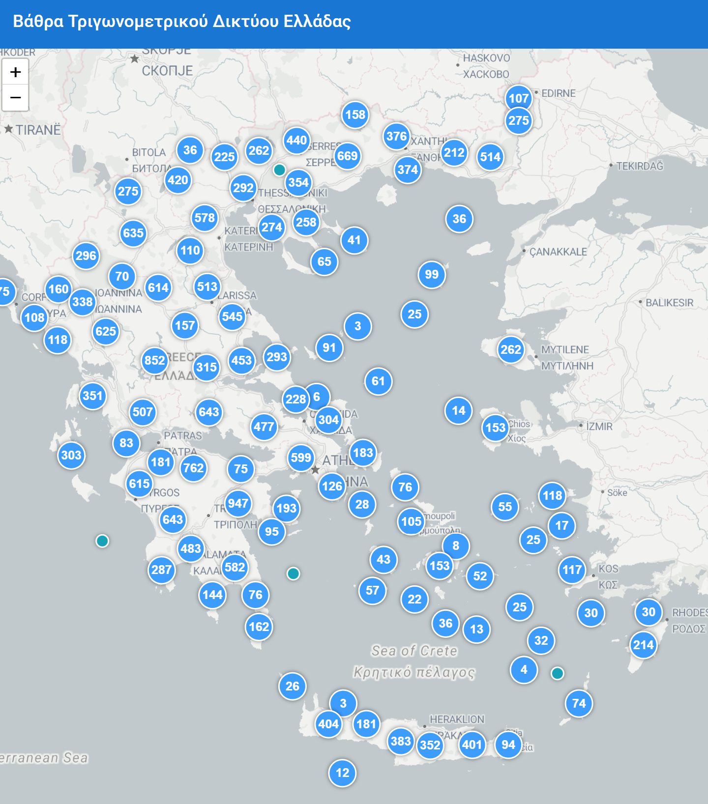

# Hellas Trig Points | Ελληνικά Τριγωνομετρικά Σημεία

 A crowd-sourced, interactive map dedicated to documenting the status and accessibility of the Hellenic Army Geographical Service (ΓΥΣ) trigonometric points across Greece. This project aims to create a living archive for surveyors, hikers, and history enthusiasts.

### ✨ **Live Demo**

The project will be deployed and accessible at: **[https://vathra.gr](https://vathra.gr)**

---

## ## Features

* **Interactive Map**: A fast, mobile-friendly map displaying over 25,000 trigonometric points.
* **Marker Clustering**: Efficiently handles a large number of points for a smooth user experience.
* **Custom Styling**: Markers are color-coded based on their reported status (OK, Damaged, Unknown, etc.).
* **Social Login**: Easy and secure user authentication via Google accounts.
* **User Contributions**: Logged-in users can "check-in" at points, submit status updates, add comments, and upload photos.
* **Detailed Sidebar**: Clicking a point reveals a sidebar with detailed information, coordinates (WGS84 & ΕΓΣΑ87), and a history of user reports.
* **Map Layers**: Switch between a clean map view and a high-resolution satellite view.

---

## ## Tech Stack

This project is built with a modern, full-stack architecture.

* **Frontend**: React (with Vite), Leaflet, MUI (Material UI)
* **Backend**: Node.js, Express.js, Passport.js for authentication
* **Database**: PostgreSQL with the PostGIS extension for geospatial data
* **Containerization**: Docker & Docker Compose
* **Deployment Target**: Koyeb

---

## ## Getting Started

To run this project locally, you will need **Docker Desktop** installed.

1.  **Clone the repository:**
    ```bash
    git clone [https://gitlab.com/pierros/greece-trig-points.git](https://gitlab.com/pierros/greece-trig-points.git)
    cd greece-trig-points
    ```

2.  **Configure Backend:**
    * Navigate to the `backend` folder.
    * Create a `.env` file and add your Google OAuth credentials and a session secret.

3.  **Build and Start the Application:**
    * From the root directory, run:
        ```bash
        docker-compose up -d --build
        ```

4.  **Set Up the Database:**
    * Wait about 15 seconds for the database to initialize.
    * Run the migrations and the seeder script:
        ```bash
        docker-compose exec backend npm run migrate up
        docker-compose exec backend npm run seed
        ```

5.  **Run the Development Servers:**
    * **Backend:** `docker-compose exec backend npm run dev`
    * **Frontend:** Navigate to the `frontend` directory and run `npm run dev`.

The application will be available at `http://localhost:5173`.

---

## ## License

This project is open source and licensed under the **GNU AGPLv3**. See the [LICENSE](LICENSE) file for details.